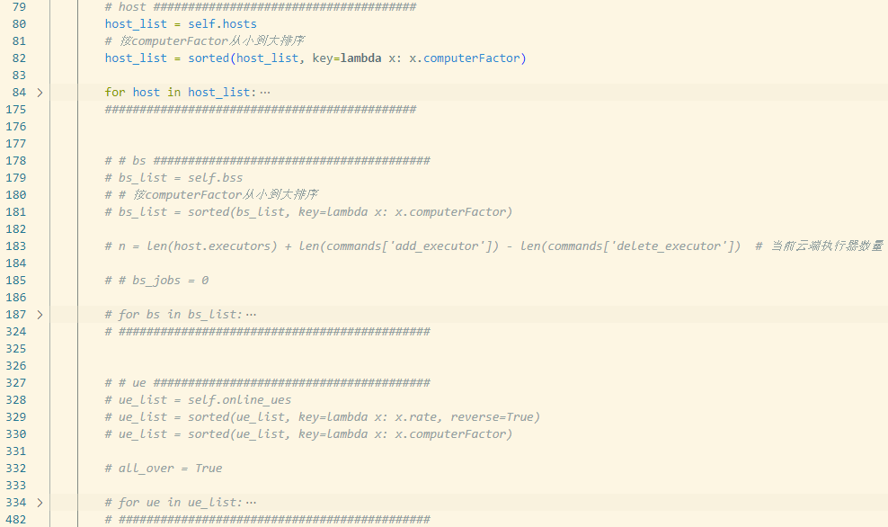

# 536决赛代码说明

## 代码文件概要

536决赛成绩实现所用代码主要有三个文件：plan.py; plan_obj.py; writer.py；utils.py。

最终决赛得分的取得仍未使用到训练集、深度强化学习技术，但所采用的算法框架为DRL的应用留有空间。

### plan.py

生成plan的主程序，从time=0开始，每个时隙循环执行——

1. 当前时隙策略方法.policy()；
2. 推进至下一时隙.forward_walltime(time+1)；
3. 更新任务状态。

直至所有任务完成。

```python
···
while True:
	plan_env.policy()
	time += 1
	plan_env.forward_walltime(time)
	plan_env.update_task()

	if all([job.status == JobStatus.Completed.name for job in plan_env.jobs]):
		break
···
```

### plan_obj.py

定义了继承打分函数中环境Environment类的plan环境，用于模拟时隙推进，获取任意当前时隙的已知信息。

算法主要体现在.policy()方法中，根据当前时隙已知的“状态”（.hosts/.bss/.ues/.jobs等当前时隙的资源信息属性和任务信息属性）给出“动作”字典commands。

### writer.py

定义Writer类，通过其中的add_executor_w，delete_executor_w和add_task_w方法实现**添加执行器**、**删除执行器**和**执行任务**三种plan“动作”的记录，通过其中write方法保存plan结果至./result。

### utils.py

定义了两个用于描述job剩余计算量的方法，作为job的属性。


## 算法设计思路说明

考虑到得分由任务完成率和job平均完成时间两部分构成，我们将完成所有任务作为循环跳出条件，以获得100%的任务完成率。在循环中不断进行任务部署相关决策和单位时隙推进，如下图所示。


为了最小化job平均完成时间，我们定义了理想情况下job的剩余完成时间est_rt（estimated runtime），**优先将est_rt小（容易完成）的job分配给算力强的设备执行**。另外，为了简化指令，（尽管很可能导致更差的结果）我们**不干涉已分配执行（即处于Running状态）的任务**。整个分配决策过程都遵循以上原则。

### 状态更新

所以，为了方便分配决策，在“任务到达检测与状态更新”和“任务状态更新”两个步骤中，我们实时维护着三个字典（python中的说法）：Arrived Tasks（self.arrived_tasks）简称**A表**、Candidate Task（self.candidate_tasks）简称**C表**、Arrived_jobs（self.arrived_jobs）简称**J表**。

- A表：已到达 但不可执行 的task（因为父任务未完成）；
- C表：已到达 且可执行 但未完成的任务 的task；
- J表：已到达的job及其属性（可自由定义），按est_rt从小到大排序。

每次状态更新时——

1. 如C表中有任务已完成（Completed），更新对应job的属性（J表），并将其移出C表；
2. 将A表中Ready且父任务都已完成的任务（可执行的任务）移动至C表。

### 策略

我们采用的策略框架中，host、bs、ue三者的分配决策是解耦的，且采用了几乎相同的流程分别依次进行三种设备的任务分配。

我们设置了reserved字典（**R表**）用于记录各设备上一时隙预留的executor；used列表用于保存当前时隙已经被分配了的executor，称为**U表**。

在每个时隙，我们取出C表中状态为Ready的任务待分配，简称为**CR表**。

整体决策流程如下——

按 host、bs、ue；算力从高到低 的顺序遍历设备；
	再按J表顺序遍历jobs；
		再按CR表顺序遍历job对应的task：
			有对应cat的空闲的executor则分配task；【第①种情况】；
			有对应cat的非空闲的executor（busy/preparing），则预订，将该executor序号存入R表【第②种情况】；
			没有对应cat的executor则新建executor【第③种情况】；
			无法新建executor则尝试删除free executor之后再新建【第④种情况】。

（每次分配executor后将其序号存入U表，选择executor时排除当前的U表和上个时隙预订的executor（R表中），“预订”操作保证了有用的free executor不会被提前删除。）

如果运行到第④种情况仍无法新建executor，则对于该设备spill=0(资源溢出)，在该设备未来的遍历中将不考虑第③④种情况。如果所有free executor都在U表中，则跳出该设备的遍历（这里在撰写说明时才发现决赛代码写得不好，会导致刚开始设备只有少量executor时循环提前跳出，所以仍有优化空间）。

在以上整体决策流程下，还有一些细节的考虑，例如——

为了不影响算力更强的设备按计划在未来执行更容易的任务，后遍历的设备不应从J表的第一个job开始遍历，而是应该预留足够的任务给算力更强的设备未来执行。例如，在为bs分配时进行了如下计算——

```python
n = len(host.executors) + len(commands['add_executor']) - len(commands['delete_executor'])  # 当前云端执行器数量
···
bs_exe_time = task.computeDuration * bs.computerFactor  # bs预计执行时间
func = (n * bs_exe_time) / (host_jobs_num * host.computerFactor)  # bs_exe_time时间，host的绝对计算量 “水”

pool = []  # host处理中的job “水池”
pool_ = []  # host处理之外的 “水池”

# 这里把job所需的计算量比作“水池”中的空间，bs预计执行任务所需时间下host的计算量比作“水”，水依次填满水池，如果该任务处于某个将被填的水池，说明如果将其分配给bs会影响到host的任务执行计划，故不能分配，否则，可以分配
for num, j in enumerate(self.arrived_jobs.items()):
    if len(pool) == host_jobs_num:
        pool_.append(j[1]['sum_time'])
    else: 
        pool.append(j[1]['sum_time'])

res_count = 0

continue_flag = False

while min(pool) < func:
    minus = min(pool)
    func = func - minus
    for b in range(len(pool)):
        pool[b] = pool[b] - minus
    pool = [p for p in pool if p != 0]
    while len(pool) < host_jobs_num:
        if pool_ == []:
            continue_flag = True
            break
        pool.append(pool_.pop(0))
        res_count += 1
    if continue_flag:
        break

if continue_flag:
    continue

if res_count >= bs_jobs_num:  # 不可以执行任务
    continue

else:  # 可以执行任务
···
```

即，基于对bs任务完成时间的估算和host计算进度的估算保证足够的预留job数量。

我们为ue设置了类似的**任务分配门槛**。

## 代码复现说明

运行plan.py文件为多个数据集批量生成plan，运行test.ipynb中的cell为单个数据集生成plan。

通过修改id选择不同数据集——

```python
# plan.py中
···
for id in tqdm(range(10)):
···

# test.ipynb中
···
id = 0
···
```

将plan_obj.py文件中PlanEnv.policy方法的部分内容注释可方便地实现仅host或host+bs的plan。

例如——

host+bs+ue(较慢)——


host+bs(快)——


host(很快)——



### 仿真得分结果

|               | test0    | test1    | test2    | test3    | test4    | test5    | test6    | test7    | test8    | test9    | Average       |
| ------------- | -------- | -------- | -------- | -------- | -------- | -------- | -------- | -------- | -------- | -------- | ------------- |
| host          | 29169.42 | 20301.5  | 27462.65 | 26263.6  | 21822.35 | 25660.49 | 25803.39 | 26754.3  | 21369.72 | 21016.49 | **24562.391** |
|               |          |          |          |          |          |          |          |          |          |          |               |
| host+bs       | 29231.58 | 24189.68 | 27602.95 | 26354.84 | 22703.44 | 27830.61 | 26887.08 | 27586.95 | 23213.47 | 24715.19 | **26031.579** |
| 较host增益    | 62.16    | 3888.18  | 140.3    | 91.24    | 881.09   | 2170.12  | 1083.69  | 832.65   | 1843.75  | 3698.7   | 1469.188      |
|               |          |          |          |          |          |          |          |          |          |          |               |
| host+bs+ue    | 29312.14 | 24776.26 | 27660.29 | 26594.34 | 23236.26 | 28412.72 | 27716.76 | 28095.64 | 23912.02 | 25646.48 | **26536.291** |
| 较host+bs增益 | 80.56    | 586.58   | 57.34    | 239.5    | 532.82   | 582.11   | 829.68   | 508.69   | 698.55   | 931.29   | 504.712       |


## 优势与不足说明

### 优势

1. 算法中host、bs、ue三者的任务分配决策解耦，使得可以通过注释方便地按实际情况实现，具有实现上的灵活性；
2. 算法从评价指标出发，提出了简洁高效的分配决策框架，具有算法改进上的易扩展性。

### 不足

1. host、bs、ue三者的充分解耦导致为前序设备做分配决策时可能未充分考虑后续设备的情况以及设备间的联通关系等信息。
2. 由于该算法先后遍历 设备、job、task，在在线ue数量增多时，plan生成速度较慢，可通过限制使用的在线ue数量改善。

### 优化方向

1. 在考虑为后分配设备设置怎样的任务分配门槛时，当前算法采用的是一种模拟水池注水的方法。这里还可以尝试利用DRL训练模型判断是否为先前设备预留了足够的job，更加精准。

### 代码不足

1. 目前代码在循环跳出步骤有待优化，会导致刚开始设备只有少量executor时循环提前跳出，可能还未达到算法的理论最优得分效果；
2. 目前代码有些设置并未对云端多host做修改，所以在多host场景中可能还未达到理论最优得分效果。

------

# 附录

环境中的”状态“。

资源相关的——
1. cloud_table/host_table: .hosts
   1. executors；computerFactor；rate；cpuCapacity；memoryCapacity；cpuMargin；memoryMargin；hostId；cloudId
2. bs_metric/bs_table: .bss
   1. executors；computerFactor；rate；cpuCapacity；memoryCapacity；cpuMargin；memoryMargin；bsId
3. ue_metric/e_table: .ues
   1. executors；computerFactor；rate；cpuCapacity；memoryCapacity；cpuMargin；memoryMargin；ueId；bsId；onlineTime；offlineTime

任务相关的——

1. category_table: .taskcategorys
   1. categoryId；requestCPU；requestMemory；prepareDuration
2. job_table/task_table: .jobs
    1. jobId；arriveTime；startTime；endTime；status
    2. taskId；jobId；categoryId；parentTasks；childTasks；computeDuration；outputsize；arriveTime；readyTime；startTime；endTime；status；devicetype；deviceid；savedevicetype；savedeviceid；executorid
3. 任务数量：.task_num

application中存放了和任务有关的类，device存放和资源有关的类
